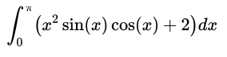

# single-variable-calculus-integration-mpi-vs-openmp

To compare OpenMP and MPI speedups let us look on such simple example of single valued integration problem:

OpenMP result:
----------
Number of quantization steps 500M
Start working thread # 0 of 2
Start working thread # 1 of 2
Result with OpenMP: 3.815784
real 17.042s
user 33.700s
sys 0.020s

MPI result:
--------------
Start working
Number of quantization steps 500M
Start working
Job is done! [250000000; 500000000] Result = 0.307341
Job is done! [0; 250000000] Result = 3.508443
Result with MPI: 3.815784
real 17.342s
user 0.090s
sys 0.030s
